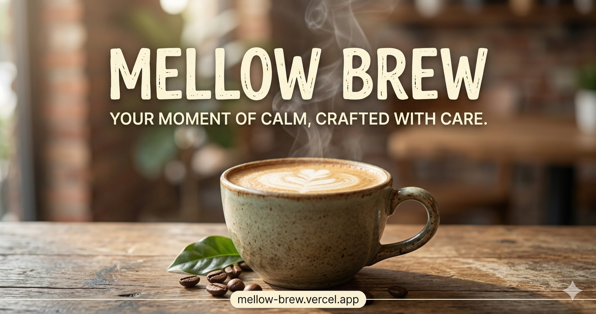

<div align="center">

# ☕ Mellow Brew

### *Slow coffee, warm moments.*

A modern, production-ready landing page template for cafes and small businesses.

[](https://nextjs.org/)
[](https://tailwindcss.com/)
[](https://www.typescriptlang.org/)
[](https://vercel.com/)
[](#-license)

[](#-performance)
[](#-performance)
[](#-performance)
[](#-performance)

**[Live Demo →](https://mellow-brew.vercel.app)**



</div>

---

## 📖 About

**Mellow Brew** is a one-page marketing site for a fictional neighborhood cafe in Bangkok — built as a portfolio piece and a reusable template for client work.

The design leans on warm, minimal aesthetics with generous whitespace, a focused palette, and content-first typography. Every section is self-contained and easy to adapt for real cafes, bakeries, restaurants, or other small businesses that need a clean online presence without the cost of a full custom build.

---

## ✨ Features

- 🧱 **7 modular sections** — Navbar, Hero, About, Menu, Gallery, Visit, Footer
- 📱 **Mobile-first responsive** — looks great from 320px to 4K
- ⚡ **Lighthouse 98 / 96 / 100 / 100** (Performance / Accessibility / Best Practices / SEO)
- ♿ **WCAG AA accessible** — semantic HTML, proper contrast, keyboard navigation
- 🔍 **SEO optimized** — Open Graph, Twitter Cards, structured metadata
- 🚀 **Fast** — FCP < 1s, LCP < 2.5s, zero layout shift
- 🎨 **Themeable** — palette defined as CSS variables, easy to rebrand
- 🧩 **shadcn/ui components** — accessible primitives you fully own
- 🌙 **Smart 404 page** — branded `not-found.tsx` keeps users on-site

---

## 🛠 Tech Stack

| Layer       | Choice                                          |
| ----------- | ----------------------------------------------- |
| Framework   | [Next.js 16](https://nextjs.org/) (App Router)  |
| Language    | [TypeScript 5](https://www.typescriptlang.org/) (strict mode) |
| Styling     | [Tailwind CSS v4](https://tailwindcss.com/)     |
| Components  | [shadcn/ui](https://ui.shadcn.com/) + Radix UI  |
| Fonts       | [Geist Sans / Mono](https://vercel.com/font)    |
| Hosting     | [Vercel](https://vercel.com/)                   |

---

## 🚀 Getting Started

### Prerequisites

- **Node.js 20+** ([download](https://nodejs.org/))
- **npm 10+** (ships with Node)

### Install

```bash
git clone https://github.com/Garagetget/mellow-brew.git
cd mellow-brew
npm install
```

### Develop

```bash
npm run dev
```

Open [http://localhost:3000](http://localhost:3000) in your browser. Hot reload is enabled — edits to any file in `app/` or `components/` show up instantly.

### Build for production

```bash
npm run build
npm run start
```

### Lint

```bash
npm run lint
```

---

## 🎨 Customization

For full instructions on rebranding (palette, fonts, content, images), see [`docs/CUSTOMIZATION-GUIDE.md`](./docs/CUSTOMIZATION-GUIDE.md).

**Quick start:**

- 🎨 **Colors** — edit CSS variables in [`app/globals.css`](./app/globals.css):
  ```css
  --cream: #FAF6F0;
  --brown: #6B4423;
  --terracotta: #C97B5C;
  --text: #2A1F1A;
  ```
- 📝 **Content** — each section is a standalone component in [`components/sections/`](./components/sections/). Edit the text and images in place; no shared state to untangle.
- 🖼️ **Images** — swap the Unsplash URLs in each section for your own (or move to local files in `public/`).
- 🧭 **Metadata** — update title, description, OG tags, and `metadataBase` in [`app/layout.tsx`](./app/layout.tsx).

---

## 📁 Project Structure

```
mellow-brew/
├── app/
│   ├── layout.tsx          # Root layout + metadata (OG, Twitter, SEO)
│   ├── page.tsx            # Main landing page (composes sections)
│   ├── not-found.tsx       # Branded 404 page
│   └── globals.css         # Tailwind v4 + design tokens
├── components/
│   ├── sections/           # Page sections (Hero, About, Menu, ...)
│   └── ui/                 # shadcn/ui primitives (Button, etc.)
├── lib/
│   └── utils.ts            # cn() helper for class merging
├── public/                 # Static assets (og-image, favicons)
├── docs/                   # Customization & deployment guides
└── package.json
```

---

## 📊 Performance

Measured on production build via Lighthouse (mobile, slow 4G throttling):

| Metric                      | Score / Value |
| --------------------------- | ------------- |
| 🟢 Performance              | **98**        |
| 🟢 Accessibility            | **96**        |
| 🟢 Best Practices           | **100**       |
| 🟢 SEO                      | **100**       |
| ⚡ First Contentful Paint   | **< 1.0s**    |
| ⚡ Largest Contentful Paint | **< 2.5s**    |
| 📐 Cumulative Layout Shift  | **0.00**      |
| ⏱ Total Blocking Time      | **< 100ms**   |

> Core Web Vitals all in the green. Lighthouse run on `next start` against the production build.

---

## 📄 License

Released under the [MIT License](./LICENSE). Free to use, fork, and adapt for personal or commercial projects.

---

## 👤 Author

**Get** — Tech Lead by day, freelance vibe-coder by night.

- 🐙 GitHub: [@Garagetget](https://github.com/Garagetget)
- 📧 Email: [getbyget@gmail.com](mailto:getbyget@gmail.com)
- 💼 **Available for freelance work** — landing pages, marketing sites, mobile-friendly web apps.

If you'd like a custom version of this template for your business, or have a different project in mind, feel free to reach out.

---

<div align="center">

Made with ☕ in Bangkok

</div>
